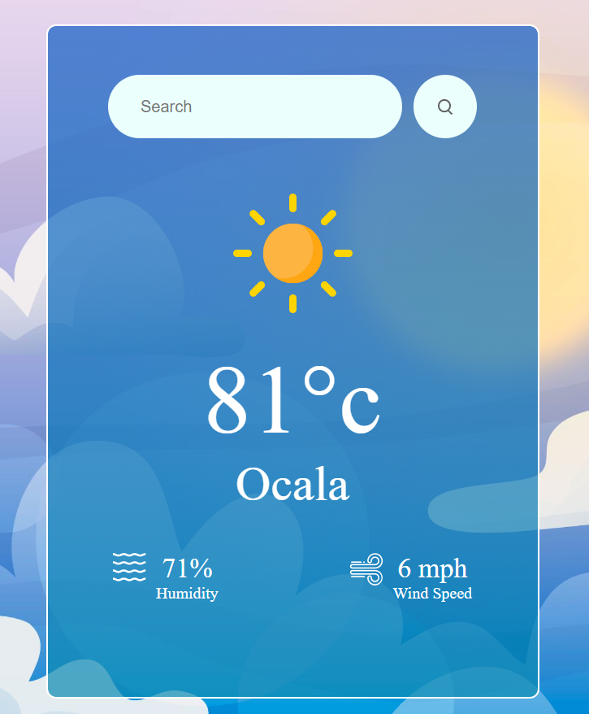

# Solis Weather App

This is a simple **Weather App** built using React that allows users to check the current weather conditions for their location or any other location they search for. It fetches weather data from the OpenWeatherMap API.



## Features

- Displays the current temperature, location, humidity, and wind speed.
- Provides an option to search for weather conditions in other locations.
- Weather Icons change based on weather conditions.

## Getting Started

To get a copy of this project up and running on your local machine, follow these steps:

### Prerequisites

- **Node.js** and **npm** installed on your computer.
**You will need to acquire an API key from:** [Open Weather Map](https://openweathermap.org/)
As this is only a front end project and replace the code:
```Javascript
const api_key = "Insert Your Key Here";
```
in the WeatherApp.jsx with your key 

### Installation

1. Clone this repository to your local machine:

   ```shell
   git clone https://github.com/JitheDev/Solis-Weather-App.git

2. Navigate to the project directory

3. Install Required Dependencies:
   ```shell
   npm install


